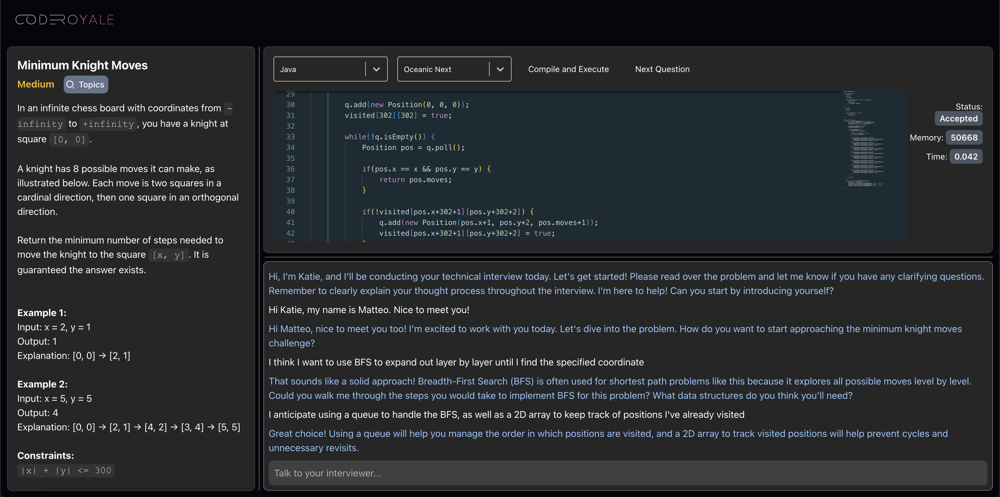
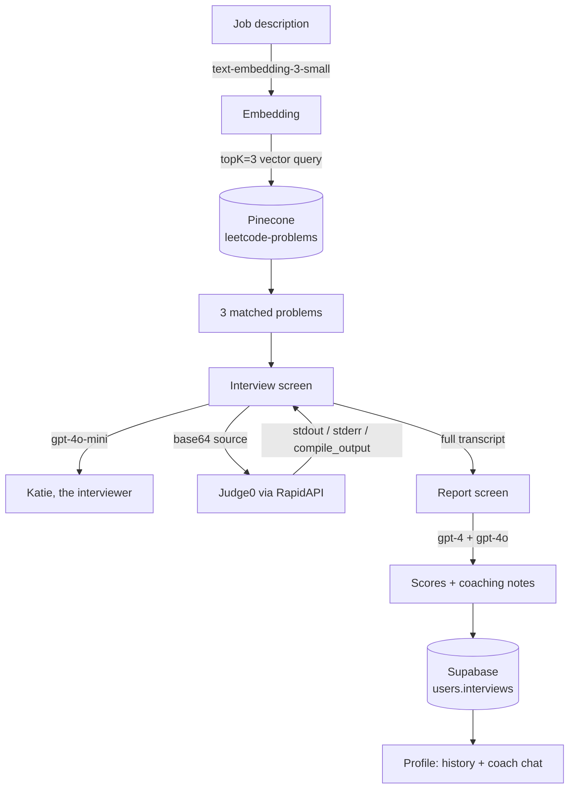
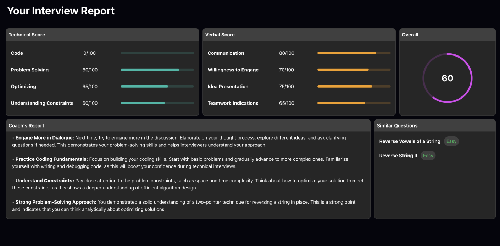

# CodeRoyale

An AI mock-interview simulator for software engineering candidates. You paste in a job
description, and CodeRoyale retrieves three LeetCode problems semantically matched to that
role, then drops you into a live technical interview: a problem statement on the left, a
real code editor that compiles and runs your submissions in the middle, and an AI
interviewer named Katie on the right who probes your reasoning, reacts to your code, and
refuses to hand you the answer. When you finish, it grades the whole transcript and files
the report to your profile, where a coaching model reads across every interview you've
done and tells you what to work on.



---

## How it works

The whole application is a client-side React SPA. There is no backend of our own — every
integration is called directly from the browser, and Supabase doubles as the auth provider
and the database.



### 1. Retrieval — turning a job description into problems

`Profile` embeds the pasted job description with OpenAI's `text-embedding-3-small`, then
queries a Pinecone index (`leetcode-problems`, namespace `version-1`) for the three nearest
problems, filtering out rows whose description is `"SQL Schema"`. Each match carries
metadata — `title`, `description`, `difficulty`, `related_topics` and `url` — which is
handed to the interview screen through React Router's navigation state.

The effect is that "senior backend role, heavy on distributed systems and caching" and
"new-grad frontend position" produce genuinely different problem sets, rather than a random
draw from a difficulty bucket.

### 2. The interview — three panes, one conversation

`Interview` is a three-pane layout with drag-resizable splitters (mouse-move handlers over
`useRef` flags, so dragging doesn't re-render the editor on every frame):

- **Problem pane.** The retrieved problem's statement, difficulty, a topics dropdown, and a
  link to the original LeetCode page. Descriptions arrive as loose markdown-ish text, so a
  formatter converts headings, bold, inline code, `Example N:` / `Constraints:` labels and
  LaTeX delimiters into HTML.
- **Editor pane.** Monaco via `@monaco-editor/react`, with 43 Judge0 language targets and the
  full `monaco-themes` catalogue selectable at runtime. On mount — and again whenever you change language or advance to the next
  question — `gpt-4o-mini` generates starter code for that specific problem in that specific
  language: an aptly named empty function, the right imports for the language's collection
  types, and two or three pre-loaded test cases, with an explicit instruction not to leak
  hints in the scaffold.
- **Conversation pane.** The dialogue with Katie.

Hitting **Compile and Execute** base64-encodes the source, POSTs it to Judge0 CE through
RapidAPI, and polls the returned token every two seconds until the submission leaves the
queued/processing states. The decoded `stdout`, `stderr` or `compile_output` is appended to
the transcript as a first-class message — and then, crucially, the app automatically prompts
Katie with *"the student just submitted code, analyze its correctness and time complexity
and discuss"*. So running your code isn't a side channel; the interviewer sees the result and
responds to it, the way a human interviewer watching your screen would.

Katie herself is a `gpt-4o-mini` call whose system prompt is rebuilt on every turn from the
running transcript, the current problem, and the latest snapshot of your editor buffer. The
prompt is written to make her behave like an interviewer rather than an assistant: nudge only
if the candidate is badly off track, let them fail, never hand over an implementation, push
them to state their own time and space complexity, invent additional test cases and edge
cases beyond the ones printed in the problem, and keep answers short.

Three questions in, **Next Question** becomes **End Interview**.

### 3. The report — grading the transcript



`Report` replays the entire transcript — including code submissions, program output and
compiler errors, each tagged by type — into four separate OpenAI calls:

| Call | Model | Output |
| --- | --- | --- |
| Technical categories | `gpt-4` | 4 interview-specific categories scored out of 100, one always `Code` |
| Behavioral categories | `gpt-4` | 4 non-technical categories (engagement, communication, attitude) |
| Overall score | `gpt-4` | A single integer, weighted to punish silence and rudeness even when the code is correct |
| Coaching notes | `gpt-4o` | 4 bullets — three improvements and one genuine strength |

The category prompts ask the model to invent categories that fit what actually happened in
that interview (a candidate who was grilled on complexity gets a `Big-O` row) and to avoid
round multiples of five, which keeps the scores from collapsing into a uniform 75/80/85.

The finished report is written to Supabase as an entry in a per-user `interviews` JSON array.
Reports are generated exactly once: on mount the screen looks up the interview ID against the
stored array, and either regenerates from scratch (new interview) or rehydrates the stored
scores (revisiting an old one), so re-opening a past report doesn't burn four model calls or
produce different numbers than the first time.

### 4. The profile — coaching across interviews

`Profile` is the home screen: an aggregate score ring, the full interview history, a
"trouble questions" panel pulled from your worst-scoring session, and a chat with a coaching
model. That coach is given a flattened summary of *every* stored report rather than a single
transcript, which is what lets it answer "what do I keep getting wrong?" instead of just
recapping one session.

---

## Tech stack

| Layer | Choice |
| --- | --- |
| Framework | React 18, Create React App 5, React Router 6 |
| Styling | Tailwind CSS 3, Tremor 3 (charts, inputs, dialogs), daisyUI, Headless UI, Remix Icon |
| Editor | Monaco (`@monaco-editor/react`) with `monaco-themes` |
| Code execution | Judge0 CE via RapidAPI, called with axios and polled by token |
| LLM | OpenAI JS SDK v4 — `gpt-4o-mini` (interviewer, starter code, coach), `gpt-4` and `gpt-4o` (grading), `text-embedding-3-small` (retrieval) |
| Vector search | Pinecone JS SDK v2 |
| Auth + database | Supabase (email/password auth, Postgres) |
| Notifications | react-toastify |

### Repository layout

```
src/
├── App.js                     Router, Supabase client construction
├── screens/
│   ├── Login/                 Email + password auth
│   ├── Profile/               Home: history, aggregate score, coach chat, job-description modal
│   ├── Interview/             Three-pane interview, interviewer prompting, starter-code generation
│   └── Report/                Transcript grading, persistence, rehydration
└── components/
    ├── Header/
    └── Editor/                Monaco wrapper, Judge0 client, language + theme dropdowns
        ├── constants/         43 language targets, custom select styles
        └── lib/               Monaco theme loader (57 themes)
```

---

## Running it locally

> **Status:** this was a two-week project built in mid-2024 and isn't hosted anywhere. No
> credentials are checked into the repository, so running it means bringing your own —
> including a Pinecone index you'll need to populate yourself (see below).

```bash
npm install
cp .env.example .env    # then fill in your keys
npm start
```

The app expects Node 18 or 20. `react-scripts` 5 is unmaintained and builds slowly on newer
Node releases.

You will need: an OpenAI API key, a Pinecone API key, a Supabase project, and a RapidAPI
subscription to Judge0 CE.

### Provisioning the Pinecone index

The ingestion pipeline that built the original index lived outside this repository, so you'll
need to create and populate the index yourself. The app queries:

- **Index** `leetcode-problems`, **namespace** `version-1`
- **Vectors** produced by `text-embedding-3-small` (1536 dimensions)
- **Metadata** on every vector: `title`, `description`, `difficulty` (`Easy` / `Medium` /
  `Hard`), `related_topics` (comma-separated, or the string `NaN`), `url`, and
  `similar_questions` (LeetCode's own `[Title, /problems/slug/, Difficulty]` format, which the
  report screen parses to suggest follow-up practice)

Embed each problem's title and description together, and the retrieval in `Profile` will work
unchanged.

### Supabase schema

A single `users` table:

| Column | Type | Notes |
| --- | --- | --- |
| `uid` | text | Supabase auth user ID |
| `interviews` | json | Array of `{ id, date, transcript, questions, report }` |

---

## Known limitations

This was built fast, as a prototype, and it shows in a few places worth naming:

- **Every API key ships to the browser.** CRA inlines `REACT_APP_*` variables into the bundle
  at build time, and the OpenAI client runs with `dangerouslyAllowBrowser: true`. That is fine
  for a local prototype and completely unshippable in public — a real deployment needs a thin
  server proxying OpenAI, Pinecone and Judge0 so the keys never leave it.
- **Model output is rendered with `dangerouslySetInnerHTML`.** A hand-rolled markdown-to-HTML
  converter feeds straight into the DOM. Since problem text comes from the vector store and
  the rest from the model, this is untrusted input in the strict sense; a real version would
  use a proper markdown renderer with sanitization.
- **Grading depends on the model returning parseable JSON.** The report calls ask `gpt-4` for
  a bare array and `JSON.parse` it directly, with no schema validation or retry. Structured
  outputs didn't exist when this was written; today this is what they're for.
- **Report generation is four sequential blocking calls**, so the report screen sits empty for
  a while. Nothing streams.
- **The interview is fixed at three questions**, and there's no timer, no resume upload, and no
  voice — all of which were on the list when we stopped.

---

## Credits

Built by [Matteo Dall'Olmo](https://github.com/matteodallolmo),
[Raj Thaker](https://github.com/rajthaker13) and
[Ningyue Liang](https://github.com/NingyueLiang) over roughly two weeks in July–August 2024,
with touch-ups through that September. Originally developed at
[rajthaker13/ai-job-interview](https://github.com/rajthaker13/ai-job-interview); this
repository preserves that full commit history.

Roughly how the work split, per the commit log:

- **Matteo** — the interview experience and the AI conversation loop: the three-pane resizable
  interview screen, the interviewer prompting and its turn-by-turn context assembly, dynamic
  starter-code generation, the multi-question flow, the entire report/grading pipeline, the
  profile screen and coach chat, and the Supabase persistence behind them.
- **Raj** — the project scaffold, the login screen, the Pinecone retrieval path and the
  LeetCode dataset behind it, the Judge0 compiler and Monaco editor components, and the
  header, layout and Tailwind configuration.
- **Ningyue** — Supabase Auth UI integration.
